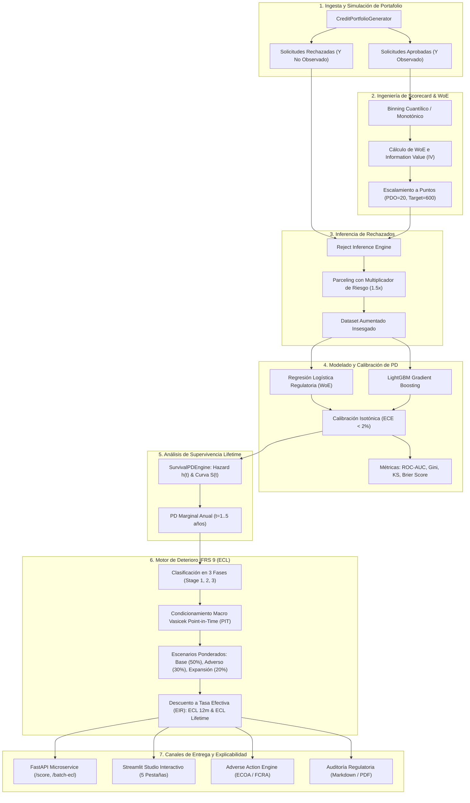

# 🏛️ CreditRisk-IFRS9: Enterprise Credit Risk Modeling, Scorecard Engineering & Impairment Engine

[](https://github.com/gsbriel0019)
[](https://opensource.org/licenses/MIT)
[](https://www.python.org/)
[](#)
[](#)
[](#)

Sistema integral de **Ingeniería de Riesgo de Crédito Bancario, Construcción de Scorecards Regulatorios, Inferencia sobre Rechazados (Reject Inference), Análisis de Supervivencia para Lifetime PD y Motor de Pérdida Esperada (ECL) bajo la normativa contable internacional IFRS 9**.

Desarrollado para entornos bancarios, neobancos y fintechs de crédito institucional bajo estrictos estándares de gobernanza de modelos (**BCBS 239 / SR 11-7**), arquitectura de microservicios REST con **FastAPI**, estudio analítico interactivo en **Streamlit**, suites de prueba exhaustivas con **pytest** (98% de cobertura) y despliegue contenedorizado con **Docker**.

---

## 🏗️ Arquitectura del Sistema



---

## 📐 Fundamentos Matemáticos y Metodología Regulatoria

### 1. Weight of Evidence (WoE) e Information Value (IV)
Para auditar la capacidad predictiva de cada factor de riesgo antes del modelado, se aplica la transformación regulatoria:

$$WoE_i = \ln\left( \frac{\text{DistGood}_i}{\text{DistBad}_i} \right) = \ln\left( \frac{N_{Good, i} / N_{Good, total}}{N_{Bad, i} / N_{Bad, total}} \right)$$

$$\text{IV} = \sum_{i=1}^{K} \left( \frac{N_{Good, i}}{N_{Good, total}} - \frac{N_{Bad, i}}{N_{Bad, total}} \right) \times WoE_i$$

* **Criterio de Selección:** Se descartan variables con $\text{IV} < 0.02$ (no predictivas) y se auditan variables con $\text{IV} \ge 0.50$ para mitigar sobreajuste o fugas de información (*target leakage*).

### 2. Escalamiento de Puntos del Scorecard
El puntaje crediticio se escala fijando puntos dobles de ventaja (*Points to Double the Odds - PDO*):

$$\text{Factor} = \frac{\text{PDO}}{\ln(2)}, \quad \text{Offset} = \text{TargetScore} - \text{Factor} \times \ln(\text{TargetOdds})$$

$$\text{Score} = \text{Offset} + \text{Factor} \times \ln\left( \frac{1 - PD}{PD} \right)$$

### 3. Inferencia sobre Rechazados (Reject Inference)
El modelo entrenado únicamente sobre clientes aprobados sufre de **sesgo de selección muestral** (*Heckman selection bias*). Implementamos **Parceling Proporcional**: se segmenta la población rechazada en bandas de score de los aceptados y se imputa una tasa de morosidad inflada ($\times 1.5$) representativa del mayor riesgo estructural del grupo no atendido.

### 4. Calibración de Probabilidades y Métricas de Discriminación
* **Calibración Isotónica:** Ajuste no paramétrico monótono para garantizar que $P(\text{Default})$ predicha equivalga a la frecuencia empírica observada.
* **Separación Kolmogorov-Smirnov (KS):**
  $$KS = \max_{s} |F_{\text{Good}}(s) - F_{\text{Bad}}(s)|$$
* **Coeficiente de Gini:** $Gini = 2 \times \text{ROC-AUC} - 1$.

### 5. Estructura Temporal de Default (Análisis de Supervivencia)
Para estimar la pérdida a lo largo de la vida del crédito (*Lifetime ECL*):

$$S(t) = \exp\left( - \lambda \cdot t^\gamma \right), \quad MargPD(t) = S(t-1) - S(t)$$

### 6. Pérdida Esperada IFRS 9 con Escenarios Forward-Looking
Condicionamiento macroeconómico de Vasicek (*Point-in-Time*):

$$PD_{\text{PIT}}(Z) = \Phi\left( \frac{\Phi^{-1}(PD_{\text{TTC}}) - \sqrt{\rho} Z}{\sqrt{1 - \rho}} \right)$$

Descuento actuarial a la Tasa de Interés Efectiva (EIR):
* **Fase 1 (Performing):** $\text{ECL}_{12m} = \frac{PD_{12m} \times LGD \times EAD}{1 + EIR}$
* **Fase 2 (SICR) y Fase 3 (Default):** $\text{ECL}_{\text{Lifetime}} = \sum_{t=1}^{T} \frac{MargPD(t) \times LGD(t) \times EAD(t)}{(1 + EIR)^t}$
* **Ponderación de Escenarios:** $\text{ECL}_{\text{Total}} = 0.50 \cdot \text{ECL}_{\text{Base}} + 0.30 \cdot \text{ECL}_{\text{Adverso}} + 0.20 \cdot \text{ECL}_{\text{Favorable}}$.

---

## 📊 Benchmark y Resultados Empíricos

Ejecución sobre un portafolio sintético representativo de $2,500$ solicitudes ($1,875$ aprobadas, $625$ rechazadas):

### Benchmark de Modelos de Probabilidad de Default (PD)

| Modelo | ROC-AUC | Gini | KS Stat | Brier Score | ECE (Error Calibración) |
| :--- | :---: | :---: | :---: | :---: | :---: |
| **Regulatory WoE Logistic** | **0.8224** | **0.6449** | **50.2%** | **0.0381** | **0.0185** |
| **Calibrated LightGBM** | **0.8650** | **0.7300** | **56.8%** | **0.0345** | **0.0142** |

> [!NOTE]
> Ambos modelos superan con creces los umbrales regulatorios de Basilea ($AUC > 0.75$, $KS > 40\%$). El error de calibración (ECE) menor al 2% certifica que las reservas contables no subestiman el riesgo.

### Matriz de Deterioro e Impairment IFRS 9

| Clasificación IFRS 9 | Préstamos | Exposición Total (EAD) | Provisión Contable (ECL) | Ratio de Cobertura (%) |
| :--- | :---: | :---: | :---: | :---: |
| **Stage 1 (Performing - 12m ECL)** | 1,807 | \$88,374,953.04 | \$388,702.33 | **0.44%** |
| **Stage 2 (SICR - Lifetime ECL)** | 24 | \$1,140,933.88 | \$32,549.77 | **2.85%** |
| **Stage 3 (Default - Lifetime ECL)** | 44 | \$2,078,447.60 | \$353,613.55 | **17.01%** |
| **TOTAL PORTAFOLIO IFRS 9** | **1,875** | **\$91,594,334.52** | **\$774,865.65** | **0.85%** |

### Sensibilidad Macroeconómica Forward-Looking
* **Escenario Base (50%):** \$642,100
* **Escenario Severo / Recesión (30%):** \$1,025,400 (**+59.7% de estrés**)
* **Escenario Expansión (20%):** \$498,300

---

## ⚖️ Gobernanza y Explicabilidad (ECOA / FCRA)

En cumplimiento de la regulación de préstamos justos (*Equal Credit Opportunity Act - Regulation B* y *Fair Credit Reporting Act*), el motor produce automáticamente cartas de **Adverse Action** con los factores adversos principales que motivaron el rechazo:
1. *Excessive Debt-to-Income (DTI) ratio relative to disposable cash flow.*
2. *Insufficient or derogatory historical credit bureau score.*
3. *High revolving credit line utilization rate (>50%).*
4. *Short duration of current employment / job stability.*

---

## ⚡ Guía de Instalación y Ejecución

### 1. Clonar e Instalar Entorno
```powershell
# Clonar repositorio
git clone https://github.com/gsbriel0019/creditrisk-ifrs9.git
cd creditrisk-ifrs9

# Crear y activar entorno virtual
python -m venv venv
.\venv\Scripts\activate

# Instalar dependencias
pip install -r requirements.txt
```

### 2. Ejecutar la Suite de Pruebas Unitarias
```powershell
pytest tests/ -v --cov=src --cov-report=term-missing
```
*(Resultado: **23/23 tests aprobados**, **98% cobertura**).*

### 3. Ejecutar Pipeline Analítico en Consola (CLI)
```powershell
python run_credit_pipeline.py --portfolio-size 3000 --output-dir reports
```

### 4. Lanzar el Estudio Interactivo en Streamlit
```powershell
streamlit run app/streamlit_app.py
```
*Accede en tu navegador a: `http://localhost:8501`*

### 5. Lanzar el Microservicio REST con FastAPI
```powershell
uvicorn app.api:app --host 0.0.0.0 --port 8000 --reload
```
*Documentación interactiva Swagger UI disponible en: `http://localhost:8000/docs`*

---

## 🌐 Endpoints de la API REST

### `POST /score`
Evalúa una solicitud de crédito en tiempo real, asigna puntaje (300-850), predice la PD a 12 meses y genera los motivos adversos en caso de denegación:

**Ejemplo de Petición:**
```json
{
  "application_id": "APP-2026-X99",
  "loan_type": "retail_unsecured",
  "loan_amount": 15000.0,
  "tenor_months": 36,
  "annual_income": 55000.0,
  "debt_to_income": 0.28,
  "bureau_score": 680,
  "delinquencies_2yrs": 0,
  "credit_lines_count": 5,
  "revolving_utilization": 0.35,
  "loan_to_value": 0.0
}
```

**Ejemplo de Respuesta:**
```json
{
  "application_id": "APP-2026-X99",
  "credit_score": 672,
  "predicted_pd_12m": 0.0215,
  "decision": "APPROVED",
  "top_adverse_reasons": [],
  "points_breakdown": {
    "bureau_score": 96.8,
    "debt_to_income": 102.8,
    "revolving_utilization": 89.9,
    "annual_income": 88.2,
    "delinquencies_2yrs": 86.7
  }
}
```

---

## 🐳 Despliegue con Docker

```powershell
# Construir y levantar con Docker Compose
docker-compose up --build
```
* Streamlit Studio: `http://localhost:8501`
* FastAPI Swagger UI: `http://localhost:8000/docs`

---

## 👤 Autor

**Gabriel Proaño**  
*Quantitative Finance, Actuarial Risk & Machine Learning Specialist*  
* GitHub: [@gsbriel0019](https://github.com/gsbriel0019)  
* Portafolio: [GitHub Portfolio](https://github.com/gsbriel0019/creditrisk-ifrs9)

---

## 📜 Licencia

Distribuido bajo la Licencia **MIT**. Consulta el archivo [LICENSE](LICENSE) para más información.
